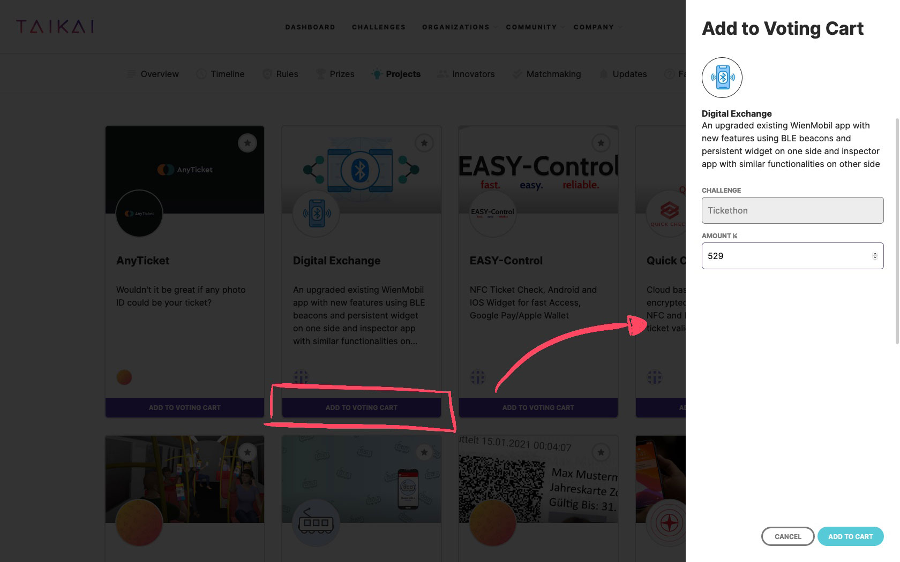
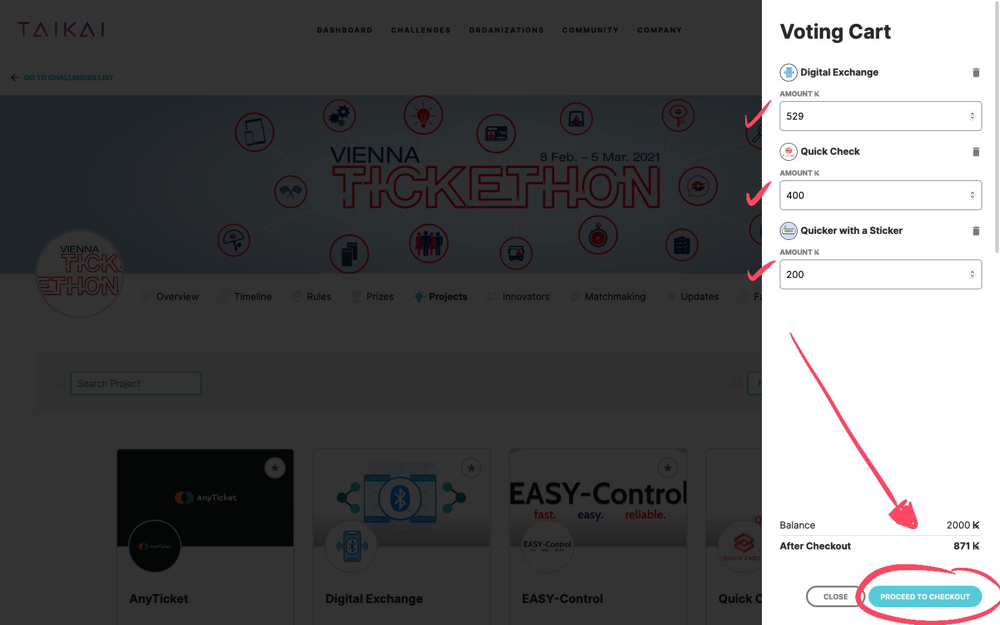
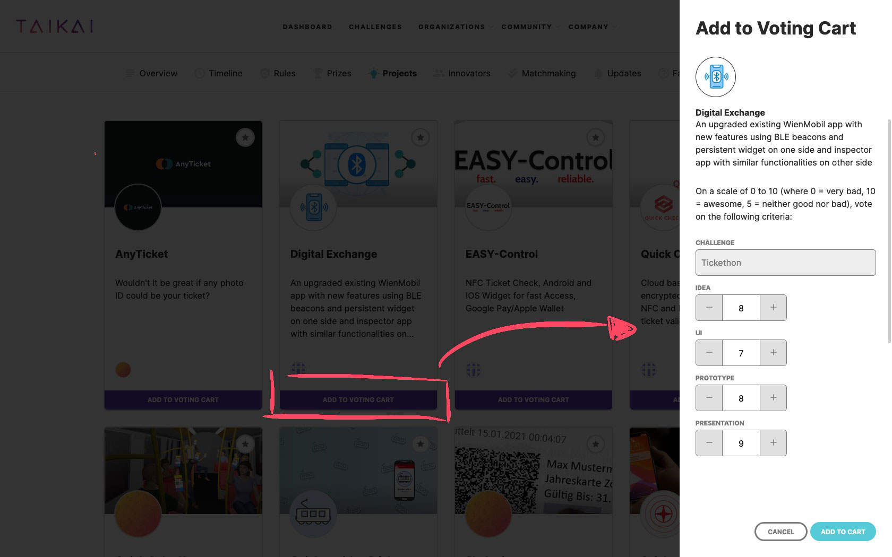
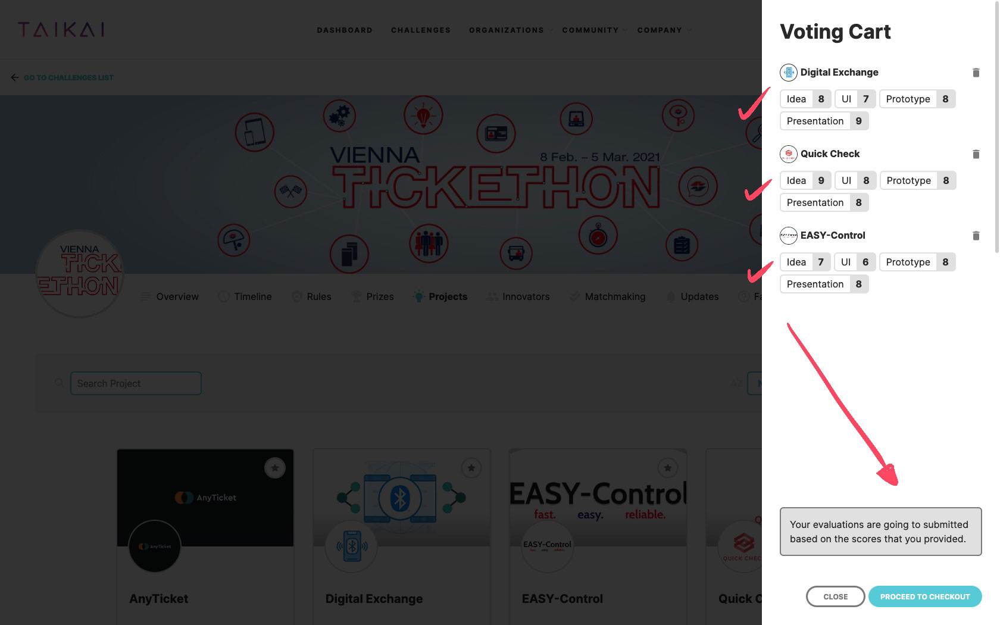

Who said voting couldn’t be fun and easy?

At TAIKAI, voting replicates the dynamics of what you can find in the real world and a real economy.
As a Jury (or Backer, as we like to call), you get KAI (TAIKAI’s social token) that you’re able to distribute to the projects that you believe that deserve it, until your balance runs out.

That means that the winning projects will be the ones that are awarded the most KAI throughout the competition.

Complicated? Not exactly!

## Voting Types

We have two ways for you to vote, depending on the established rules by the challenge Organization:

- Simply based on **KAI distribution**: you see a project you like, you just add it to your voting cart. Once you’re done voting, just like on regular e-commerce, you confirm the **KAI you want to assign to each project** and checkout;
- Based on **criteria**: you check each project and assign a value from **1 to 10 to it for each criteria** (e.g., Innovation, Feasibility, Presentation, etc.). All your voting will be added to your Voting Cart so that once again you’re able to confirm your selection and criteria points and proceed to checkout.

:::note
Independently of having a public or secret voting, the votes that you make are registered in a public blockchain, making them on one side immutable once you vote and transparent at the end of the event for the community to be able to check them and understand what happened during the voting phase(s).
:::

## Steps

1. First, sign up for TAIKAI using the link you were given on your Jury Invite. In the case you didn’t receive an invitation, just signup at [taikai.network/signup](https://taikai.network/signup) and inform the Organization you did so. After confirming your account through the link sent to your email, please log into TAIKAI using your username/email and password.

2. Projects created on your challenge will be listed on the TAIKAI platform challenge page. By clicking on a specific project, you’ll see its title, cover, logo, description, team, and all the work done up to that date.

3. The dynamics of voting in your challenge are what you can find in the real world and in an entire economy. As a Jury, you’re also an investor in TAIKAI. You’ll be awarded with KAI (TAIKAI’s social token) to select the top projects that will win the challenge. When the voting starts, **you can invest in the projects you like the most using your KAI**.

## How to Vote
### Voting using KAI distribution

To vote in a project, you simply **transfer KAI tokens to the projects you love**. To do that:

- Go to the **projects page** you want to vote on and click on the **“Add to Voting Cart”** button;
- You **select as many KAI tokens as you think the project deserves** and add them to your Voting Cart;
- You put the eggs in several baskets or go all-in. It’s up to you!
- After you’re done with repeating the process for all projects you want to vote, **just click on your Voting Cart, confirm your transactions and click on “checkout”**.

And you’re done!

### Voting using criteria

Using **Voting Criteria** has a similar process to using KAI distribution. To vote yo:

- Go to the **projects page** you want to vote on and click on the **“Add to Votting Cart”** button;
- You assign a value from **1 to 10 to it for each criteria** (e.g., innovation, feasibility, presentation, etc.).
- You **repeat the process for each project**, and your voting will be added to your Voting Cart.
- When you’re done voting, just click on your **Voting Cart**, confirm your criteria values, and click on **“Checkout”**.

By doing that, **we’ll calculate how many KAI tokens we will distribute to the projects, according to the criteria values** you’ve inserted and the weight each criteria has on the total criteria balance.

We wish you a good investment!

:::caution
Every investment in a project, either coming from a selected jury, participants, or TAIKAI community, will be entirely immutable, traceable and transparent, by design. So remember to double-check your voting before you back a project as it can’t be reversed.
:::