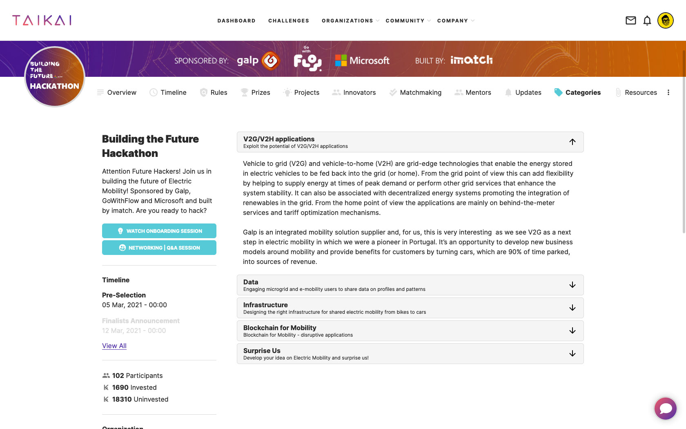
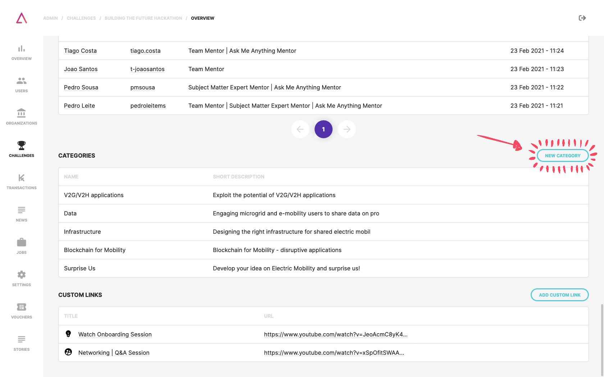
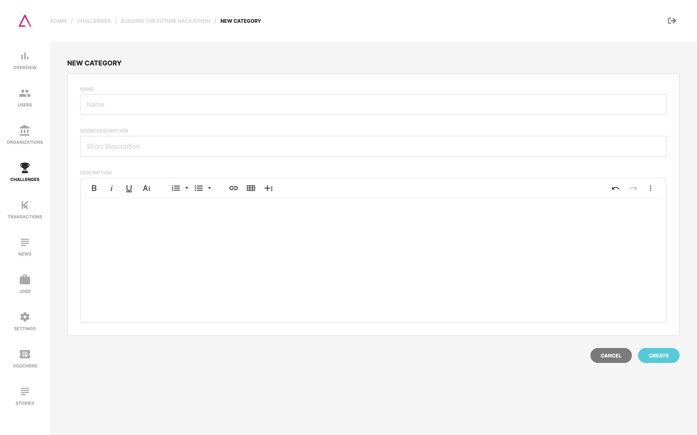
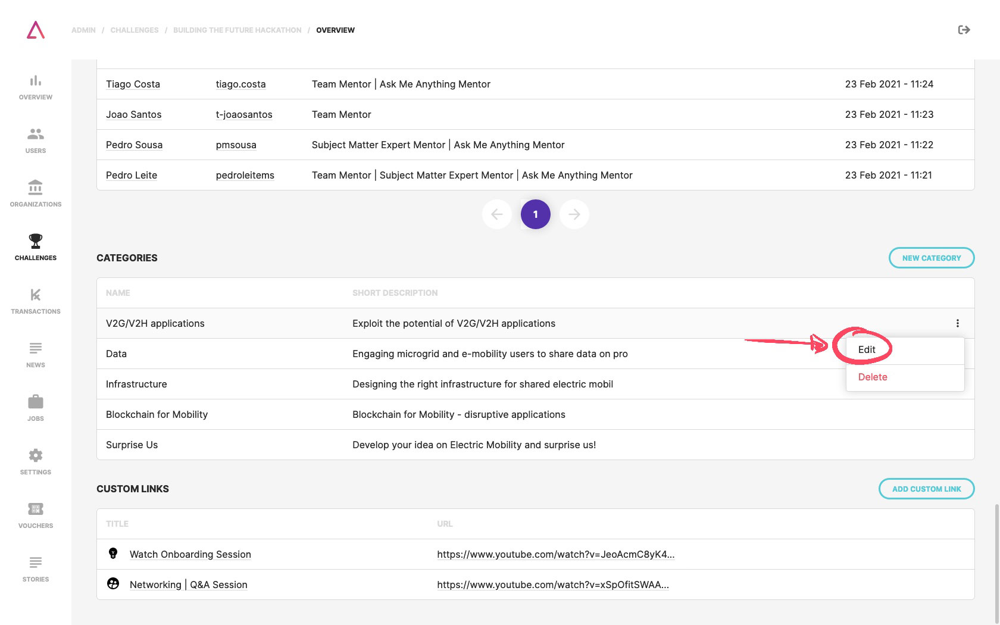
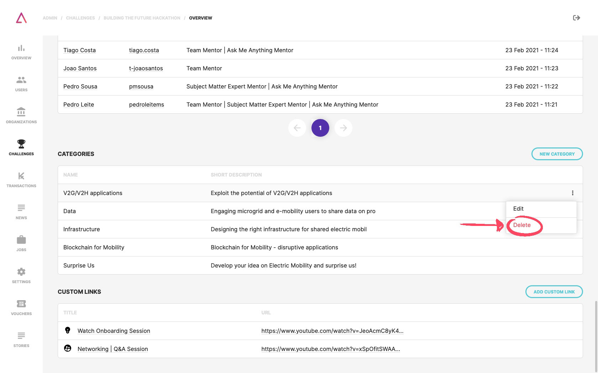

It is possible to **create categories** within a challenge to make it **easier to organize projects in different themes**. Thus teams will be able to associate one or more categories to their projects. This allows, for example, that in a scenario where a challenge has different prizes by theme/category, projects are filtered by them.

## Create Categories

On your challenge page (CMS), at the bottom, you can find the **categories section**. Here you can see all your categories, create new ones, edit and delete existing categories.

To create a new category, you just need to click on the **"New Category"** button and fill out the form with:
1. Category **name**;
2. Category **short description**;
2. Category **description**;

## Edit Categories

If you hover the table row, you can find a three dots button. This button opens an action menu with the option to **edit an existent category**.

## Delete Categories

If you hover the table row, you can find a three dots button. This button opens an action menu with the option to **delete an existent category**. After deleting a category, that category will disappear from the challenge page and any previously added project.