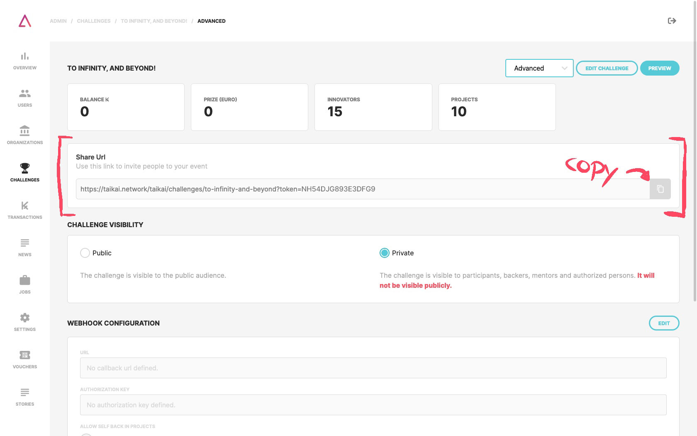

The TAIKAI platform offers **two visibility** options for challenges:

- **Public:** the challenge is visible to the public audience;
- **Private:** the challenge will not be visible publicly and just is visible to participants, backers, mentors, and authorized persons.

On the advanced page of the challenge, you find the **"challenge visibility"** section where you can edit if the challenge goes public or private.

## Public Challenges

A "Public Challenge" **will be visible on the TAIKAI platform**, and any user will be able to see it. Some challenge menus will be visible only to users registered on the TAIKAI platform.

## Private Challenges

If the challenge is private, **just participants, backers, mentors, or users who use the token link can view it**. This token link is a URL with a token that allows those who use it, even if they are not participating in the challenge, can see it. You can find this link on the challenge overview page and advanced page.

You have a couple ways to give **access to the challenge**:

1. Send an invite to be a participant;
2. Send an invite to be a mentor;
3. Send an invite to be a jury;
4. Add a user manually to be a participant, mentor, or jury;
5. Send the token link to a non-participant of the challenge;

:::note
The "Private Challenge" option is only available on some TAIKAI plans.
:::