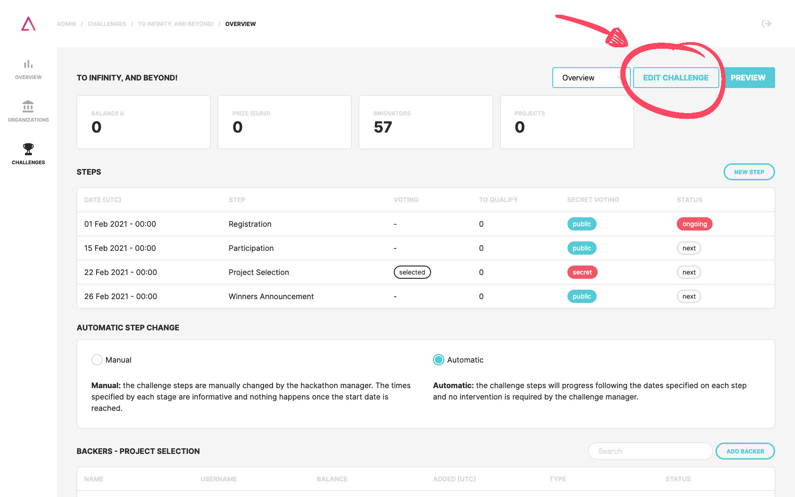
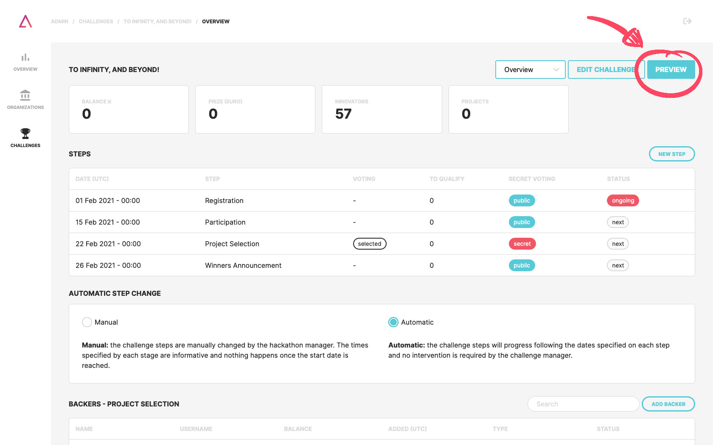

### 1. Challenges List

Click on the **challenges menu** and click on your challenge on the **"Unpublished Challenges"** subsection. There will be a button to **"Edit Challenge"** on the right top corner;

### 2. Edit Challenge
**Edit your challenge** and click on **"Save"** when you're done. Here you can change:
- Challenge name;
- Images:
  - Logo (400x400);
  - Cover (1920x400);
  - Card (640x360);
- Prizes, maximum projects allowed, type of participants, dates, etc;
- Challenge short description;
- Project template to guide your participants.

:::note
By clicking on "Preview" button you can see the result of the changes regarding your challenge as it will be presented to participants.
:::

### 3. About
Definition and long description. Switch from "Overview" to "About" on the top right corner. **The goal on this section is to detail what the challenge is about** and what is the macro-result you want to achieve.

### 4. Rules
These rules are the **Challenge Terms & Conditions**. Some examples of conditions that should be present in these rules:
- Who posts the challenge?;
- Who may apply (18 or more, students, etc.)?;
- Challenge timeline;
- Deliverables;
- Selection process;
- Prizes;
- Intellectual property;
- Challenge cancellation conditions;
- Other relevant conditions.

:::note
Here’s a good example you can get inspiration from: [taikai.network/gulbenkian/challenges/hack-for-good-home/rules](https://taikai.network/gulbenkian/challenges/hack-for-good-home/rules)
:::

### 5. Timeline
In this tab you should **define all the steps of the challenge** (e.g. application, participation, voting, results).

:::note
Here’s a good example you can get inspiration from: [taikai.network/gulbenkian/challenges/hack-for-good-home/timeline](https://taikai.network/gulbenkian/challenges/hack-for-good-home/timeline)
:::

### 6. Prizes
**Prizes** to be assigned **to the challenge winner(s)**.

### 7. FAQs
Set of **questions and answers** that may be useful and accessible to the participants.

### 8. List of Assets
**Files** that may be considered **relevant to the participants** such as guides and other tools.