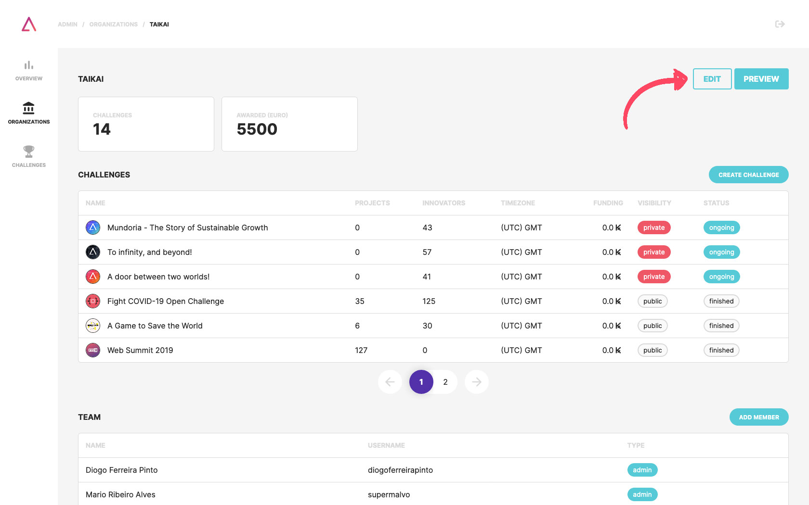
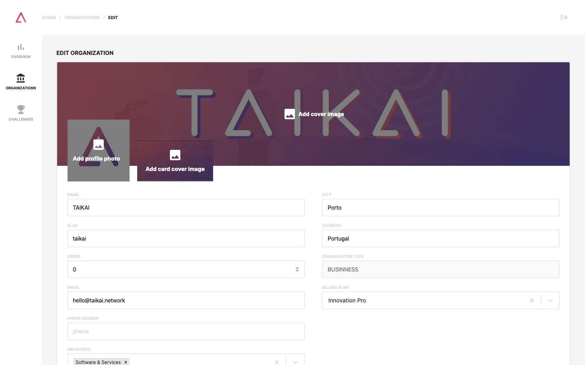
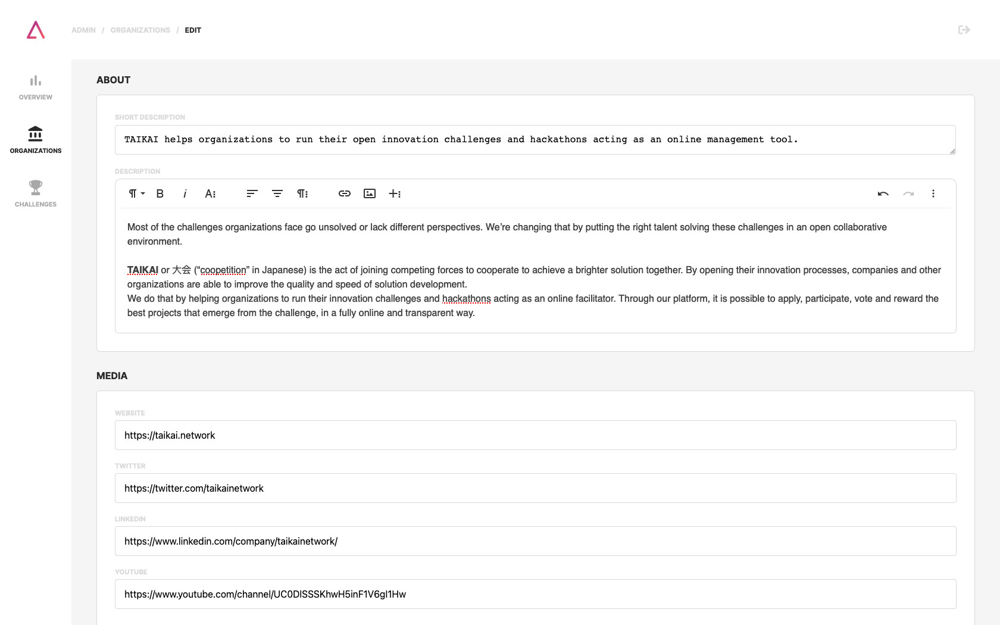
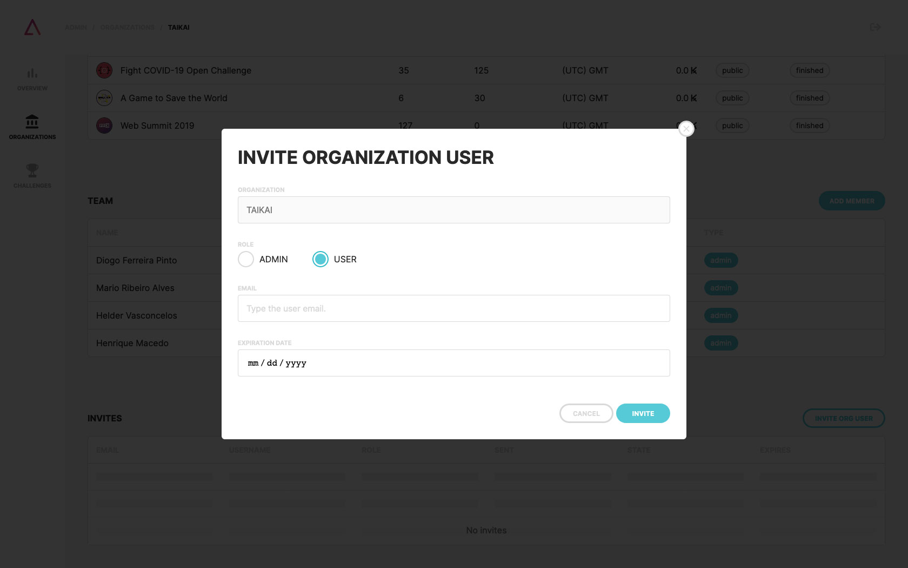

1. Click on the **"EDIT" button** on your organization to edit it;

2. Here you can change:
- Organization name
- Images:
  - Logo (400x400);
  - Cover (1500x500);
  - Card (600x400);
- Location, email, phone number, industries, media;
- Short description.

3. On the **organizations menu** click on your organization to **add users** to your team or **invite them via email**.
