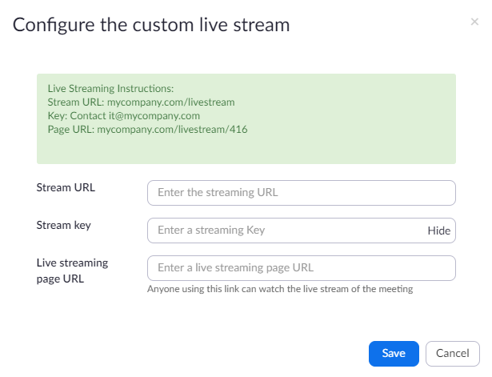
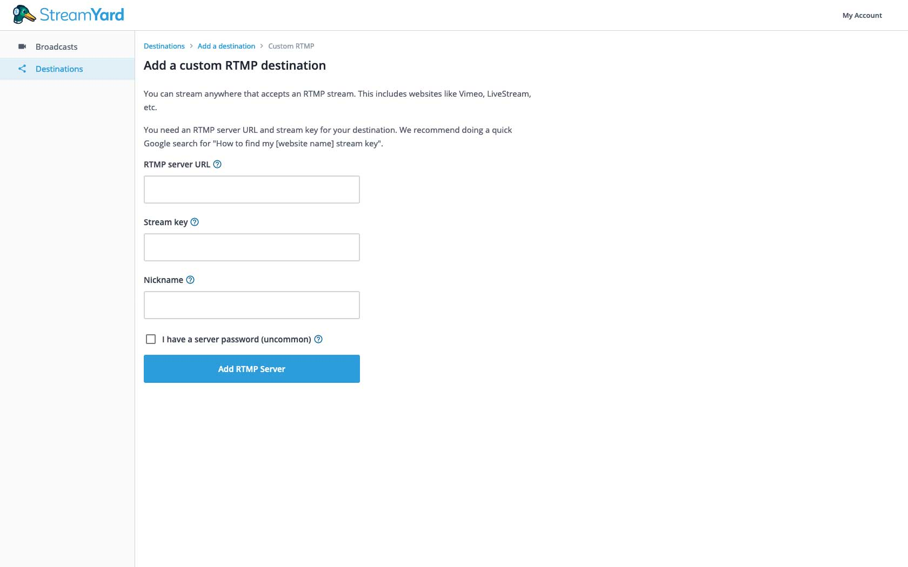
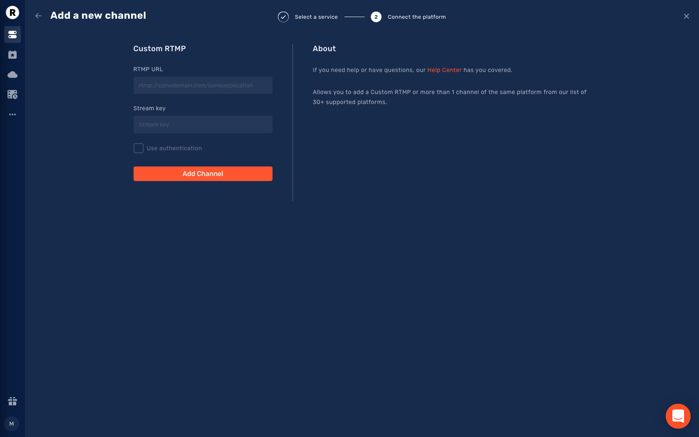

TAIKAI platform allows an organizer to livestream to a stage using a standard broadcast environment. Each stage has its own stream key that should be used to identify the stage stream and authenticate the streamer.
TAIKAI supports live streaming using the RTMP protocol, which is supported by most broadcast software/hardware as well as open source software for mobile applications.

Youp will need software that can push an RTMP stream. That software will be configured using the **Stream Key** and the **Stream URL**.

> The Stream Key should be treated as a private key for live streaming. Anyone with the key can use it to stream video to the Live Stream it belongs to, so make sure your users know to keep it safe.

## Get the Stage Stream Key and URL

1. Go to **[cms.taikai.network](https://cms.taikai.network)** and login using the username and password provided;
2. Go to the Challenge Page on your list of challenges;
3. Go to Video/Live Stream Tab;
4. On the Stage list click on the Stage Action menu and copy the stream key and url for further use.

With the *Stream Key* and the *Stream URL* you are ready to livestream using your favorite broadcast environment.

## Streaming with OBS
OBS is Free and open source software for video recording and live streaming available for Linux and macOS.
You can download it from the [Official Page](https://obsproject.com/).

### Preparation
Before you configure the settings required to livestream to TAIKAI it is important to setup the OBS:

* Video Sources for your livestream
* Output Video Rate
* Output Audio Rate

The success of your live stream is directly influenced by the video quality, and this is where the OBS bitrate comes in. If you get it wrong, you will experience increased buffering or a very low-quality stream.

The bitrate you can stream at depends on your Internet upload speed.

> For live streaming, we recommend an ideal upload speed of 5Mbps (5000kbps). This is enough to stream at your desired resolution, including 720p at 30 fps and 1080p at 60fps. The minimum upload speed for smooth streaming with good quality is 3Mbps (3000kbps).

### Output Setup
In this step you are going to configure OBS to broadcast your video to a TAIKAI Live Stage.

1. Open OBS, and click on **Settings**. There are two ways you can do this—either access the **Settings** option through **File** or just click on it from the bottom right corn;
2. Click on the **Stream** option in the resulting window;
3. Select the **Custom** Service and fill them with the Stream URL and the Stream Key retrieved from the previous steps;

4. Now you can go the main window and click on "Start Streaming";
5. WOW If everything goes well you will start seeing your transmission on TAIKAI Live Stage Channel.

## Streaming with Zoom
[Zoom](https://zoom.us/) is a cloud-based video conferencing service you can use to virtually meet with others using video and/or audio channels.

> The streaming feature is only on paid plans, so before anything else make sure you have an account that is able to broadcast the video to TAIKAI

Zoom allows you to broadcast Meetings or Webminars to a custom platform using RTMP protocol.

### Creating a meeting broadcasted to TAIKAI

1. Sign in to the Zoom web portal;
2. Click Meetings;
3. Click Schedule a New Meeting and the required information to schedule a meeting;
4. Click Save to display a set of tabs with advanced options;
5. Click the Live Streaming tab, then click the configure live stream settings link;

6. Fill the form with the stage **Stream Key** and the **Stream URL** and fill the "Livestream URL" with "[https://taikai.network](https://taikai.network)";
7. Click Save to save your live streaming settings.

You will be able to live stream this meeting without needing to add these settings after the meeting begins.

## Streaming with StreamYard

[StreamYard](https://streamyard.com) is a live streaming studio in your browser that allows you to stream directly to other platforms.

### Creating a broadcasted to TAIKAI

1. **Sign in** to the StreamYard platform;
2. Go to the **"Destinations"** menu on the left;
3. Click on the **"Add a Destination"** option;
4. Select **"Custom RTMP"** option and fill;
5. Fill the form with the stage **Stream URL** (RTMP server URL) and the **Stream Key**. You can also add a nickname for your destination to help you organize your destination on the StreamYard platform (e.g., stage name).

When a broadcast starts on StreamYard, it will be broadcast to the chosen stage on the TAIKAI platform.

## Streaming with Restream

[Restream](https://restream.io) studio has everything you need for live stream right in your browser.

1. **Sign in** to the Restream platform;
2. On the **"Dashboard"** menu, click on the **"Add Channel"** button;
3. Select **"Custom Platform (RTMP)"** on the bottom;
4. Fill with the **Stream URL** (RTMP URL) and **Stream Key** provided by TAIKAI and click "Add channel".

When you go live on Restream studio, the broadcast will appear on the TAIKAI platform's chosen stage.

