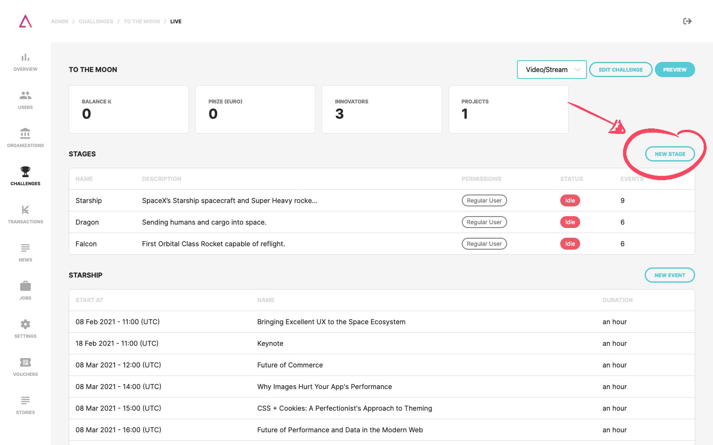
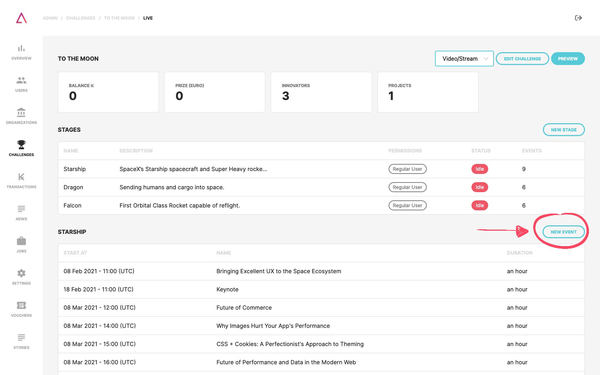

The TAIKAI platform allows the organizer to create live stream events or publish videos on demand. The organizer can create a schedule with several stages and events on each stage in the live stream functionality that will create a page dedicated to the stream and accessible through the challenge page.

1. Challenge identification;
2. Stage title;
3. Event.

## Create stages

In the video/stream page of the challenge, you find a **"new stage"** button where you can fill out the form with:

1. Stage **title**;
2. Stage **description**;
3. Select the **permissions** of that stage:
- Jury;
- Participants;
- Participants and Jury;
- Regular User (every TAIKAI user can access your stream even if he/she is not participating in the challenge).

## Crate events

In the video/stream page of the challenge, below the list of existing stages, there will be the stages already created previously. Here you just need to click on the **"new event"** button and fill out the form with:

1. Event **title**;
2. Event **description**;
3. Select the **stage** created previously;
4. What **date and time** the event will take place and how long it will take;
5. You can also add a **thumbnail** for the video player of the event.