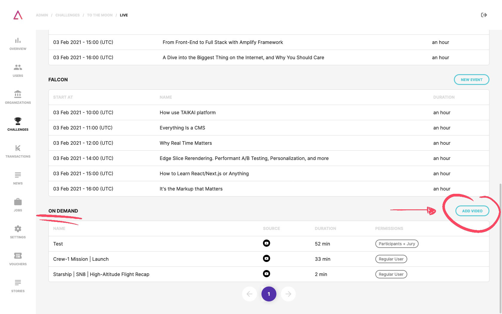

In addition to the live stream functionality, the TAIKAI platform also supports viewing videos that already exist on YouTube or Vimeo. Thus it is possible to integrate all the multimedia content in just one platform giving a better experience to the challenge participants.

On the video/stream page of the challenge, below the stages list, there will be a section called "On Demand." Here you just need to click on the "add video" button and fill out the form with:

1. Video **title**;
2. Video **description**;
3. Video URL;
3. Video **permissions**:
- Jury;
- Participants;
- Participants and Jury;
- Regular User (every TAIKAI user can access your stream even if he/she is not participating in the challenge).