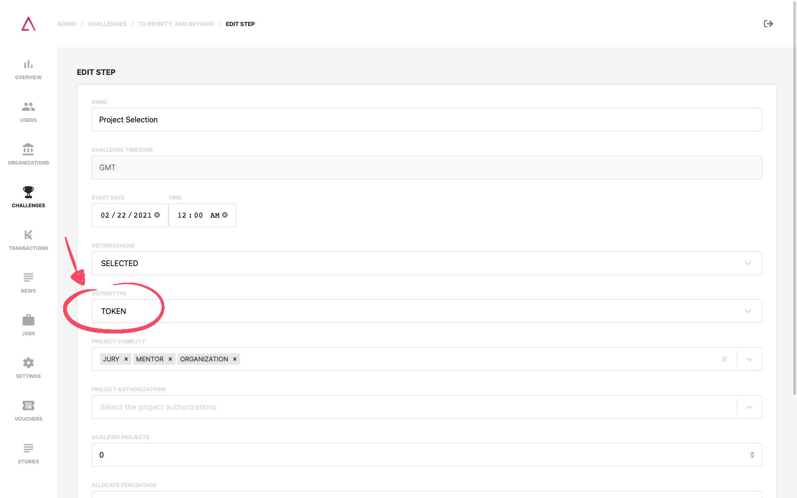
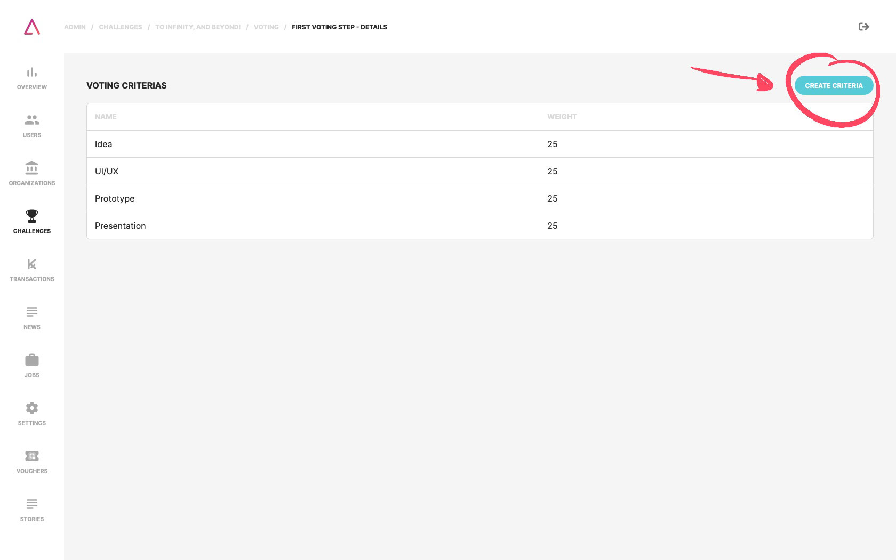
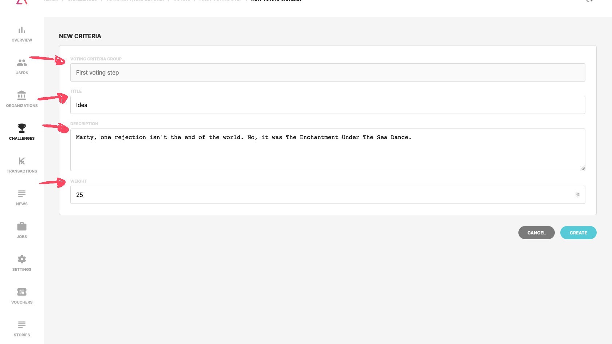
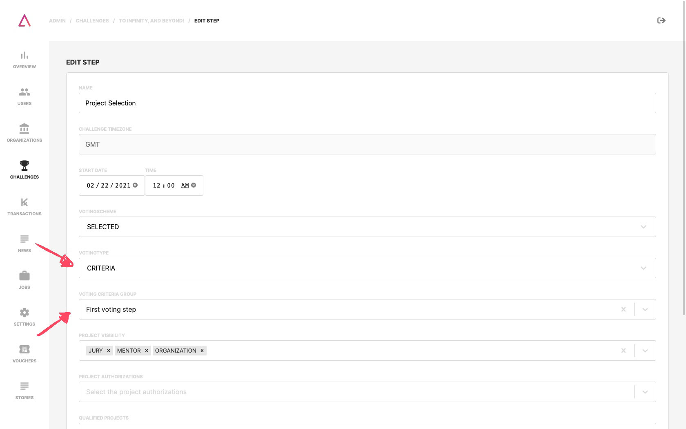

## Voting Types

We have two ways for you to choose how your jury can vote:

- Simply based on **KAI distribution**: the jury sees a project they like and just adds it to their voting cart. Once they’re done voting, just like on regular e-commerce, they confirm the **KAI they want to assign to each project** and checkout;
- Based on **criteria**: they check each project and assign a value from **1 to 10 to it for each criteria** (e.g., Innovation, Feasibility, Presentation, etc.). All their voting will be added to the Voting Cart so that once again, they’re able to confirm their selection and criteria points and proceed to checkout.

:::note
Independently of having a public or secret voting, the votes that their make are registered in a public blockchain, making them on one side immutable once you vote and transparent at the end of the event for the community to be able to check them and understand what happened during the voting phase(s).
:::

## Voting carts

On the voting page of the challenge, you find a **Voting Carts section**. Here you can find all the existing **carts in some voting step**. It can be seen to whom the cart belongs, if it has already been submitted, the value of tokens that will be submitted, the criteria and respective values chosen, etc.

## Voting using KAI distribution

On the overview page of the challenge, you find the steps section. When you create or edit a step, you find an **option to select the token voting type**.

## Voting using criteria

On the voting page of the challenge, you find the **Voting Criteria Groups section**. Here, new criteria groups can be created, or existing groups can be managed. **A group of criteria can be chosen for each voting step**. For example, having a group of criteria that focuses more on the project's originality containing more theoretical criteria and another group focused on the project's execution containing more practical standards.

### Create a Voting Criteria Group

To create a **Voting Criteria Group**, you just need to go to the "Voting" and:

1. Click on the **Create Criteria Group** button;

2. Set a **name** to your new group;
3. Hover the table row where your new group is, and on the three dots button, you find an action menu with the option for **Edit Criteria**;

4. Create **new criteria or edit existing ones**:
- Criterion **name**;
- **Description** of the criterion;
- The **weight** that the criterion will have in the voting process.

### Select Voting Criteria type

On the overview page of the challenge, you find the steps section. When you create or edit a step, you find an **option to select the criteria voting type**.

Once the type of voting with criteria has been chosen, it is possible through the option **"voting criteria group"** to determine which group of criteria to be applied in this step.