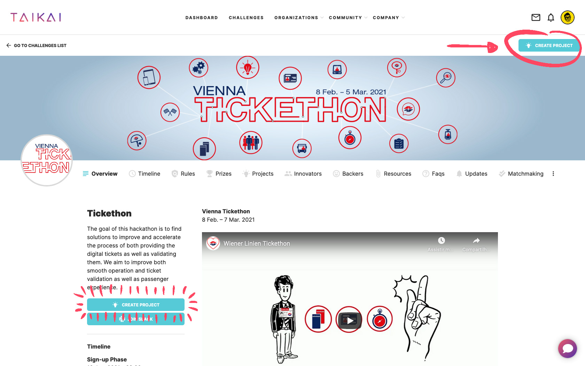
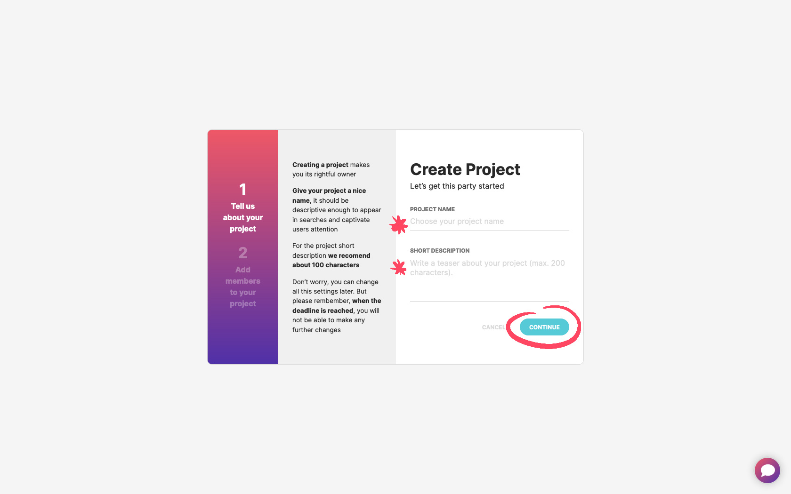
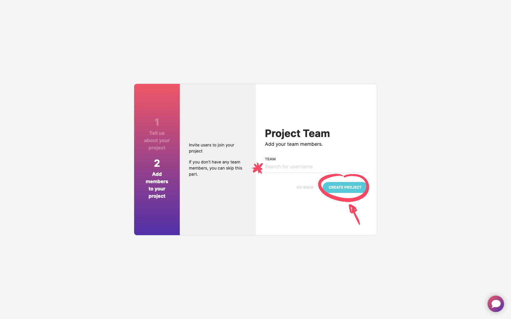

The hackathon projects must be submitted through TAIKAI's website. As soon as the project registration opens, you can create one for your team. On the challenge page, hit the **"Create Project"** button on the screen's **top right or on the left sidebar**.

From there, you need to provide the **title** of your project and a **short description** of what you're planning to build.

After that, **add your team members** to your project. Remember that all team members need to be registered on the TAIKAI platform and associated with the challenge. Once you've completed adding your team members, click on "Create Project" button.

