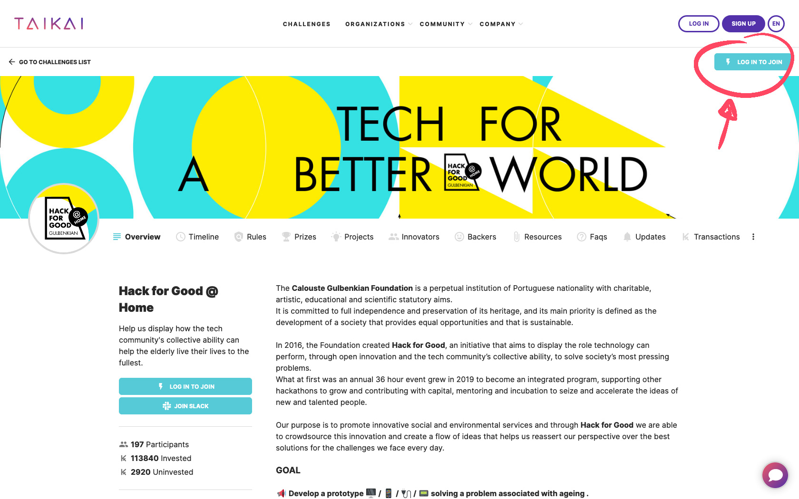

## Be an Innovator

As soon as the innovators registration opens, you can complete the registration process before creating your project. On the challenge page, hit the **"Log In to Join"** button or **"Join Challenge"** if you are already logged in, on the top right of the screen and **fill the form**.

## Log In

If you **have an account** on TAIKAI:

1. Go to the [Login page](https://taikai.network/login);
2. Use the same email used on sign up process and insert your password.

:::note
If you used a GitHub or Google account on sign up process please choose one of that options.
:::

## Sign Up

If you **don’t have an account** in TAIKAI:

1. Go to the the [Sign Up page](https://taikai.network/signup);
2. You can sign up **with your email** or using a **GitHub** or **Google** account.

:::note
If you sign up through the email confirm your account through the link sent to your email.
:::